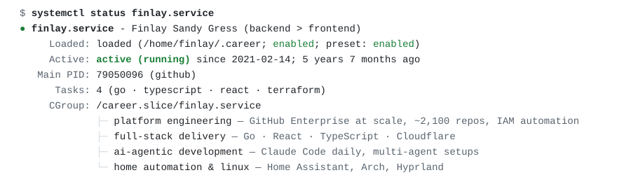
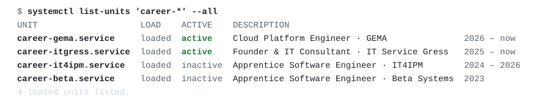
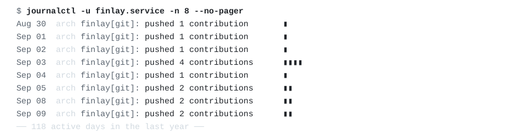
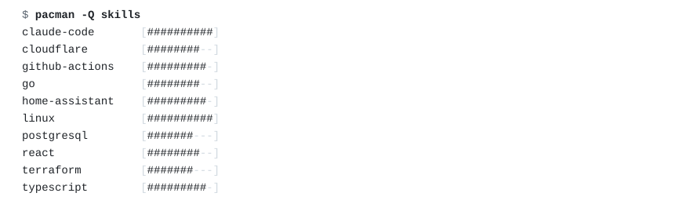
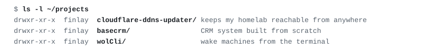
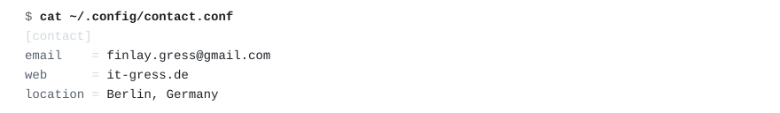

<!--
    ┌─────────────────────────────────────────────────────────────┐
    │  you're reading the source of a README. respect.            │
    │                                                             │
    │  $ sudo pacman -S hire-finlay                               │
    │  resolving dependencies...                                  │
    │  :: hire-finlay requires: coffee, interesting-problems      │
    │                                                             │
    │  this page regenerates itself every 6 hours:                │
    │  scripts/generate.py + .github/workflows/update.yml         │
    └─────────────────────────────────────────────────────────────┘
-->

<picture>
  <source media="(prefers-color-scheme: dark)" srcset="assets/hero-dark.svg">
  
</picture>

<picture>
  <source media="(prefers-color-scheme: dark)" srcset="assets/status-dark.svg">
  
</picture>

<picture>
  <source media="(prefers-color-scheme: dark)" srcset="assets/career-dark.svg">
  
</picture>

<picture>
  <source media="(prefers-color-scheme: dark)" srcset="assets/journal-dark.svg">
  
</picture>

<picture>
  <source media="(prefers-color-scheme: dark)" srcset="assets/skills-dark.svg">
  
</picture>

<picture>
  <source media="(prefers-color-scheme: dark)" srcset="assets/projects-dark.svg">
  
</picture>

open the directories: [basecrm](https://github.com/derFinlay/basecrm) · [cloudflare-ddns-updater](https://github.com/derFinlay/cloudflare-ddns-updater) · [wolCli](https://github.com/derFinlay/wolCli)

<picture>
  <source media="(prefers-color-scheme: dark)" srcset="assets/contact-dark.svg">
  
</picture>

[finlay.gress@gmail.com](mailto:finlay.gress@gmail.com) · [it-gress.de](https://it-gress.de) — this page rebuilds itself every 6 hours via [a cron job](.github/workflows/update.yml)
